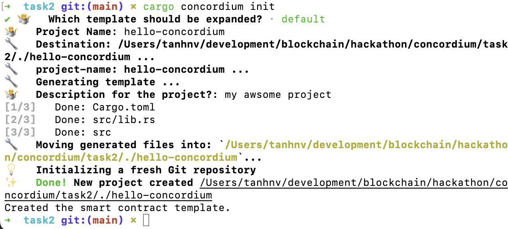
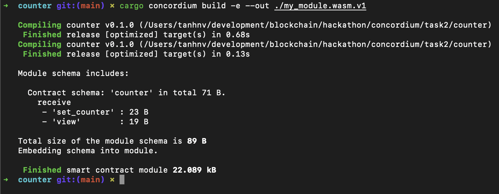
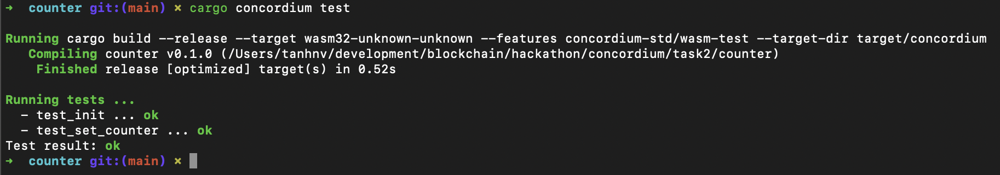
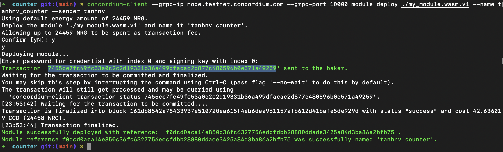
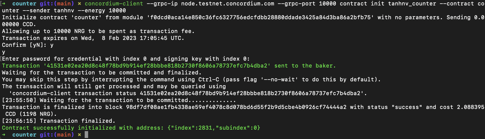
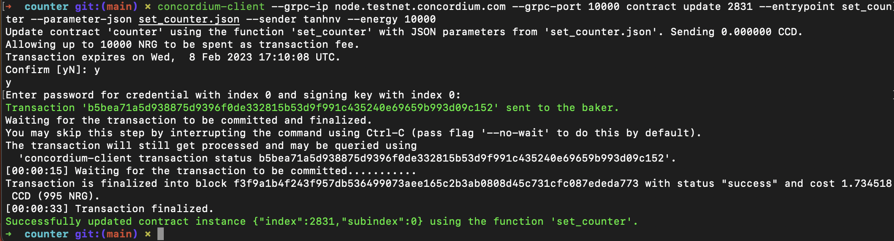
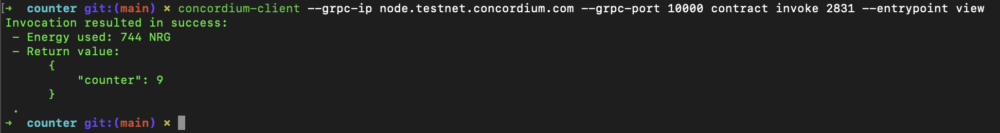

# Concordium Hackathon - TASK 2: Deploy Your First Smart Contract

## My wallet address

- Concordium Address (Mainnet): 4Ab5VSBALWbNHbUwksYNstZWnTD1zrWgV57VQNbixNxFPq4yBa
- USDT Address (Metamask): 0xB883e40202417671fDaC9A2D1Dbbf6a49bDA796e

## My process

### Generate a new project

```zsh
cargo concordium init
```



### Compile the project

```zsh
cargo concordium build -e --out ./my_module.wasm.v1
```



### Test the project

```zsh
cargo concordium test
```



### Deployment



```
7455ce7fc49fc53a0c2c2d19331b36a499dfacac2d877c480596b0e571a49259
```

### Contract init


Index: `2831`

```
41531e02ea20d8c48f78bd9b914ef28bbbe818b2730f8606a78737efc7b4dba2
```

### Contract - Set counter



```
b5bea71a5d938875d9396f0de332815b53d9f991c435240e69659b993d09c152
```

parameter

```json
{
  "new_counter": 9
}
```

### Contract invoke (view)


